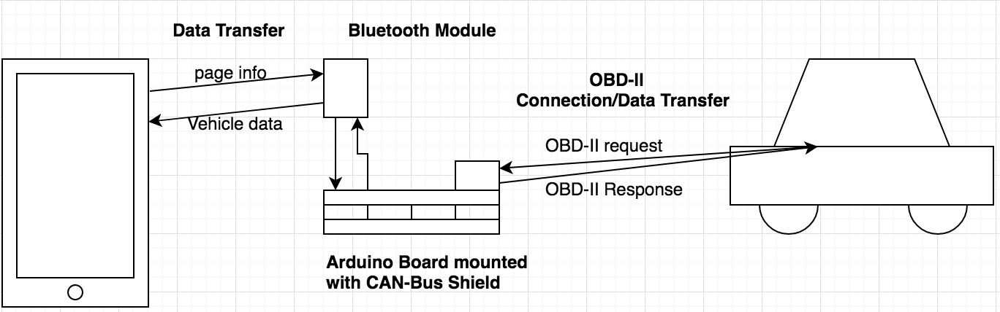
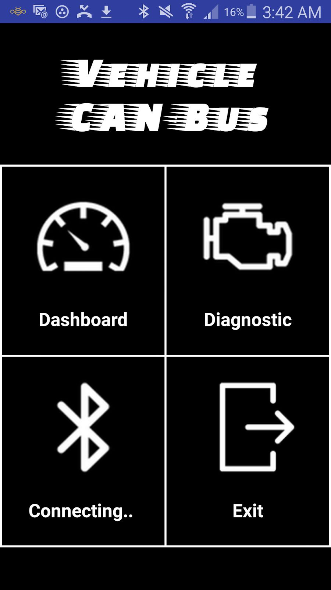
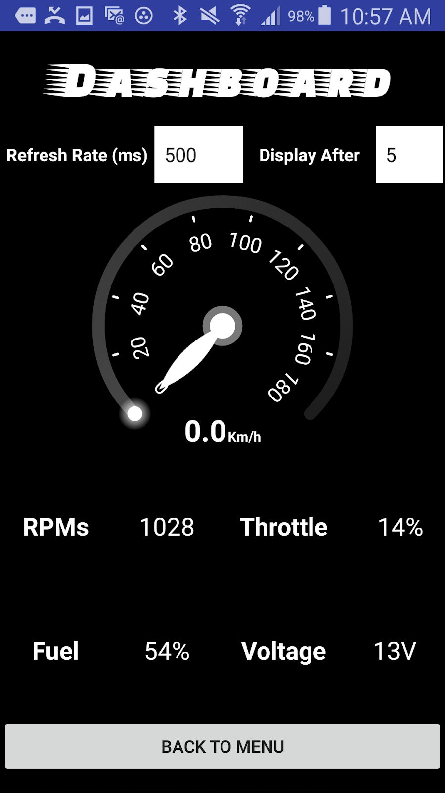
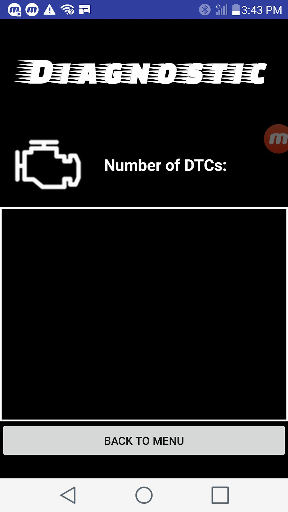

# Access to Vehicle CAN Bus

> A two-part diagnostic system: an Arduino reads live data from a vehicle's OBD-II / CAN-Bus, an Android app displays it over Bluetooth.

<p align="center">
  
</p>

<p align="center">
  
  
  
</p>

---

## What it does

- **Real-time dashboard** — Speed, RPM, throttle position, fuel %, and battery voltage streamed live from the vehicle.
- **Diagnostic Trouble Codes** — Reads stored DTCs the same way a shop scanner would.
- **Wireless** — Android phone pairs to the on-board Arduino via Bluetooth; no laptop in the car.
- **Standards-based** — Uses OBD-II Mode `01` (current data) and Mode `03` (DTCs) over CAN.

## How it works

```
┌─────────────┐   Bluetooth   ┌─────────────────┐   CAN-Bus    ┌─────────┐
│ Android App │ ◄───────────► │ Arduino + Shield│ ◄──────────► │ Vehicle │
│  (Java)     │   serial      │ (Mechanic lib)  │   OBD-II     │  ECU    │
└─────────────┘               └─────────────────┘              └─────────┘
```

The Android app sends a one-character page indicator (`m`, `d`, `c`) over Bluetooth. The Arduino responds with the data appropriate to that page — either DTCs, a stream of live PIDs, or a CAN heartbeat. See [`arduino/README.md`](arduino/README.md) for the wire protocol.

## Hardware

| Component | Notes |
|---|---|
| Arduino Uno (or compatible) | Any AVR Arduino with SPI for the CAN shield |
| CAN-Bus Shield | MCP2515-based (e.g. SeeedStudio) |
| OBD-II → DB9 cable | Connects the shield to the vehicle's diagnostic port |
| HC-06 Bluetooth module | TX/RX on pins 4/5, baud `57600` |
| Android device | API 16+ (Jelly Bean), Bluetooth required |
| Vehicle | Model year 2008+ (CAN OBD-II mandate) |

## Repository layout

| Path | Contents |
|---|---|
| [`mobile-app/`](mobile-app/) | Android Studio project — Java source, Gradle build, resources |
| [`arduino/`](arduino/) | `Sketch_mech_CAN.ino` and protocol documentation |
| [`libraries/`](libraries/) | `mechanic-0.6.zip` — Arduino CAN-Bus library used by the sketch |
| [`docs/`](docs/) | Full project report (PDF) and extracted diagrams / screenshots |
| [`demo/`](demo/) | Video walkthrough of the working system |

## Getting started

### Flash the Arduino
1. Open the Arduino IDE.
2. Install the bundled Mechanic library: *Sketch → Include Library → Add .ZIP Library…* → [`libraries/mechanic-0.6.zip`](libraries/mechanic-0.6.zip).
3. Open [`arduino/Sketch_mech_CAN/Sketch_mech_CAN.ino`](arduino/Sketch_mech_CAN/Sketch_mech_CAN.ino), select your board, and upload.

### Build the Android app
1. Open the [`mobile-app/`](mobile-app/) folder in Android Studio.
2. Let Gradle sync, then **Run** on a device or emulator (real hardware needed for Bluetooth).
3. Pair the phone with the HC-06 module ahead of time (default PIN `1234`).

Details and code-level notes in the [Arduino](arduino/README.md) and [mobile app](mobile-app/README.md) READMEs.

## Documentation

The full design document — requirements, architecture, testing methodology, and references — is in [`docs/project-report.pdf`](docs/project-report.pdf).

## Demo

A recorded walkthrough is available in [`demo/vehicle-demo.mp4`](demo/vehicle-demo.mp4).

## Authors

- **Kyle Booker**
- **Braeden Burrows**

Senior project, April 2018. Supervisor: Kevin O'Neil. Client: Dr. Mahnhoon Lee.

## License

[MIT](LICENSE)
